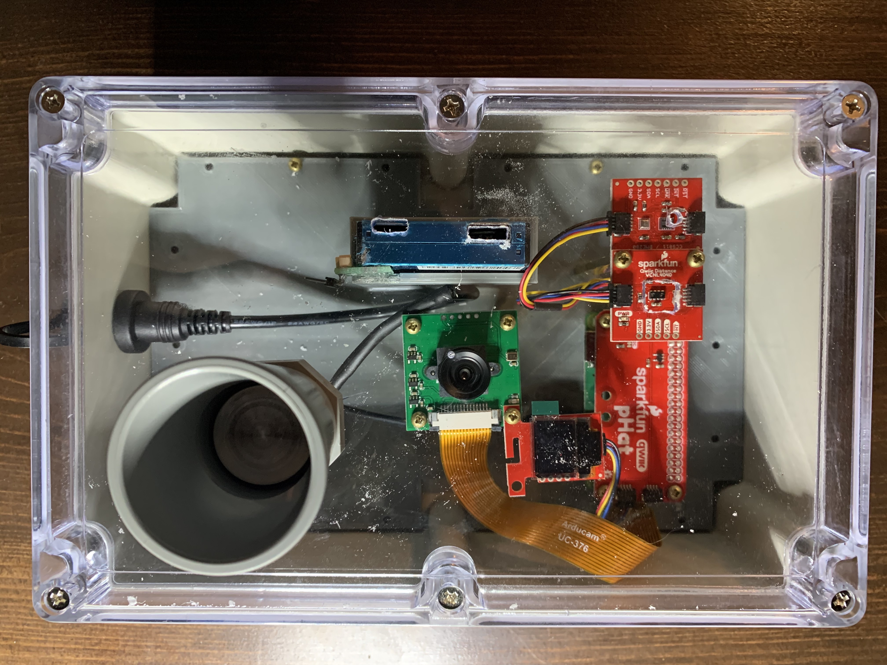
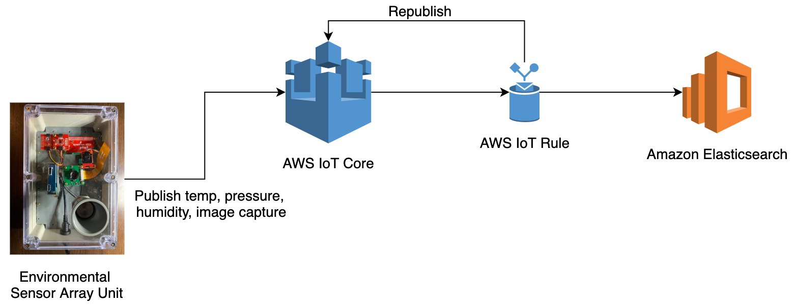

# Environmental Sensing with AWS IoT

## A project for environmental sensing - various gases, particulate matter, sound and capturing images

This is multi-part project to demonstrate environmental monitoring using several types of sensors and AWS services. The first part focuses on building the hardware and monitoring environmental parameters such as CO2, particulate matter, sound and capturing images. This project can be used for environmental monitoring in several use cases such as Industrial Manufacturing, Distribution Warehouses etc.

The first version of the environmental sensor box and the software along with it is capable of the following features:

1. Sense temperature, humidity, pressure, CO2, tvoc, proximity, and range and publish them to [AWS IoT Core](https://aws.amazon.com/iot-core/).
2. Capture and upload images to an [Amazon S3](https://aws.amazon.com/s3/) bucket.
3. The project also uses the [AWS Systems Manager](https://aws.amazon.com/systems-manager/) to enable remote access to the Raspberry Pi.
4. How to use [AWS IoT Rules](https://docs.aws.amazon.com/iot/latest/developerguide/iot-rules.html) to log data to [Amazon Elasticsearch Service](https://aws.amazon.com/elasticsearch-service/)

## Hardware and Mechanical

List of off the shelf hardware used to build the environmental sensing unit:

* [Raspberry Pi Zero W](https://www.raspberrypi.org/products/raspberry-pi-zero-w/)
* [SparkFun Qwiic Kit for Raspberry Pi](https://www.sparkfun.com/products/15367)
* [Ultrasonic Range Finder - HRXL-MaxSonar-VR](https://www.sparkfun.com/products/11724)

The unit supports a camera with Raspberry Pi to capture images and load them to AWS S3.
The camera used:

* [Arducam Lens Board SKU B0031](https://www.arducam.com/product/arducam-5mp-m12-picam/)

You could use any other compatible camera as well.

A baseplate was designed and 3D printed to house the components in the following case bought from Amazon.com:

* [Universal Project Enclosure](https://www.amazon.com/gp/product/B071FLTFFW/ref=ppx_yo_dt_b_asin_title_o03_s00)

Here is an image of the assembled unit:



The first iteration of this does not support the PM2.5 (Particulate Matter 2.5) sensing - but you can see the sensor PMS7003 below the camera in the image.

## Architecture

Here is a high level architecture of the first iteration/part of this project:



## Configure & Setup AWS IoT

Read through [Setting up AWS IoT and Create a Thing](docs/AWSIoT.md). Once you have created a thing for the Raspberry Pi - make sure that the keys are present in the 'keys' subfolder. Also copy the sampleenv file as .env and provide the specifics - you will need these

### Logging data to AWS IoT Core

Prior to logging data - you should take the sampleenv file - copy it to .env and then make sure that al parameters are set correctly.
Run the script rpiQwiicAWSIoT.py to read sensor data and log to AWS IoT Core. The script calls two helper modules:

* imageCapture.py - to capture an image using hte picamera package, and upload it to S3. Note that the S3 bucket name has to be specified in the .env file.
* ultraSonic.py - this script reads the value from the Range Finder sensor if connected.

Two flags are used to control the import and execution of the above modules - S3_ENABLE and ULTRA_ENABLE in the .env file.

* If you want to exclude both or one of them - set the flag to an emptry string.
* If the module is to be included then set it to 'True'

See example below:

```bash
S3_ENABLE='True'
ULTRA_ENABLE=''
```

Once the .env file is configured correctly - you can start tbe execution as follows:

```bash
python3 rpiQwiicAWSIoT.py
```

If you want to run the program in the background, and ensure it keeps running when you disconnect your remote session in to the Raspberry Pi then execute the following:

```bash
nohup python3 -u ./rpiQwiicAWSIoT.py > output.log &

```

You can now go to the "Test" secion of the AWS IoT Console, and subscribe to the topic that you are using. The topic used for testing was the following:

```bash
telemetry/<thing_name>
```

Sample output from the unit:

```bash
{
  "timestamp": 1583361438,
  "time": "03-04-2020 17:37:17",
  "tempc": 27.63,
  "tempf": 81.752,
  "humidity": 34.475,
  "pressure": 106.863,
  "tvoc": 0,
  "co2": 400,
  "proximity": 2556,
  "ambient": 128,
  "image": "pzb827ebed3f9a-1583361438"
}
```

The data above is not using the Ultrasonic sensor readings and does not have them. The data packet also provides the image that was captured and the filename used to store in the S3 bucket.

### Storing data with Amazon Elasticsearch

We will use Amazon Elasticsearch to store transformed data and later on use it for visualization. Setup a Amazon Elasticsearch in the same region as you have used to create the IoT thing. Once your Elasticsearch is setup, go to the AWS IoT console, and setup an IoT rule. See the image below on how it is setup.

This the specific IoT rule being used to transform the incoming packets:

```bash
SELECT topic(2) as thing_name, timestamp, parse_time("yyyy-MM-dd'T'HH:mm:ssZZ", timestamp(), "America/New_York" ) as ts, tempf, tempc, humidity, pressure, co2, ambient, tvoc, proximity FROM 'telemetry/+'
```

This rule does minor transformation of the incoming data message, and the output should look as follows:

```bash
{
  "thing_name": "pzb827ebed3f9a",
  "timestamp": 1583361502,
  "ts": "2020-03-04T17:38:26-05:00",
  "tempf": 82.058,
  "tempc": 27.81,
  "humidity": 34.288,
  "pressure": 106.548,
  "co2": 400,
  "ambient": 125,
  "tvoc": 0,
  "proximity": 2555
}
```
